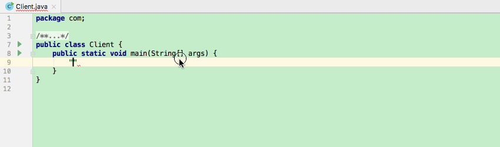

# IntelliJ IDEA

Access to information about [IntelliJ IDEA](https://www.jetbrains.com/idea/) from [online help](https://www.jetbrains.com/help/idea/getting-started.html) or install *IntelliJ IDEA Help* plugin for offline use. Course [IntelliJ IDEA神器使用技巧](https://www.imooc.com/learn/924) on <imooc.com> is also recommended.

## Skills

### Code Completion

The function is used to complete code, including loop statement, if statement and so on. **Use templates just starting with a dot `.`.** Available templates includes `.var`, `.null`, `.not null`, `.nn`, `.for`, `.fori`, `.not`, `.if`, `.cast`, `.return`. An example is shown as the following GIF.

